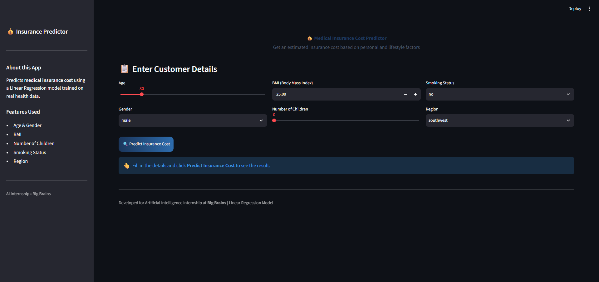
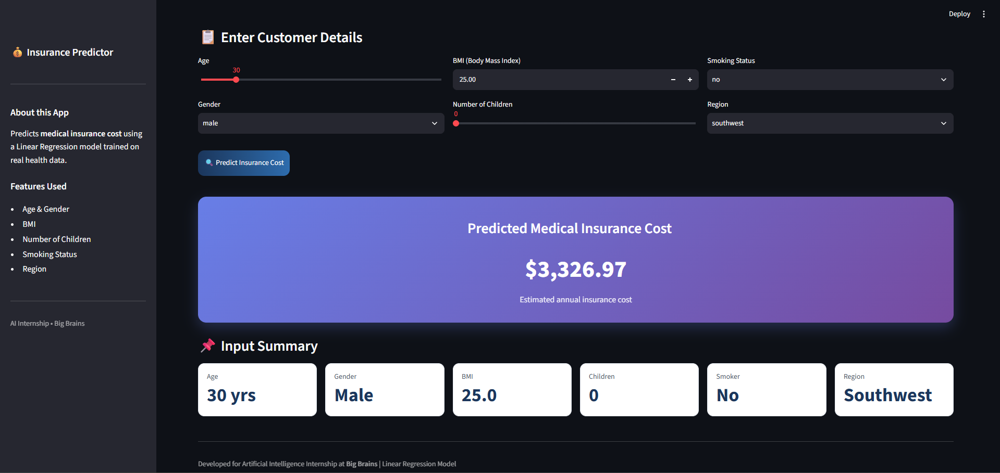
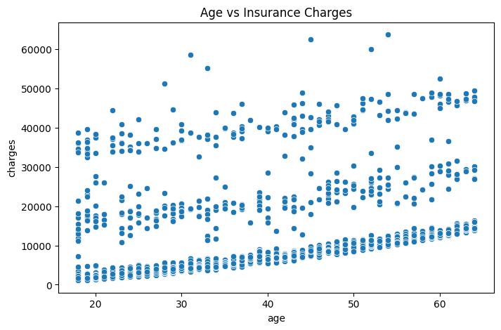
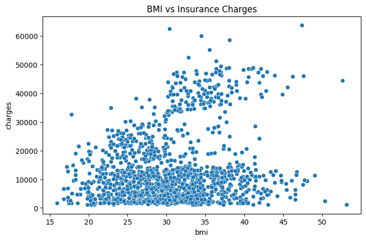
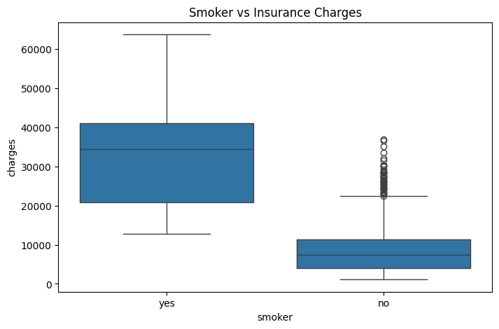
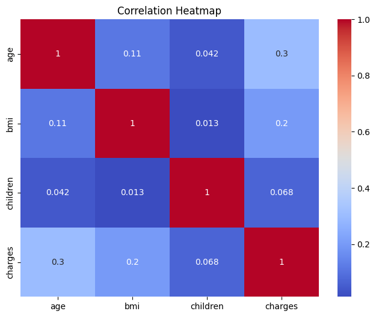
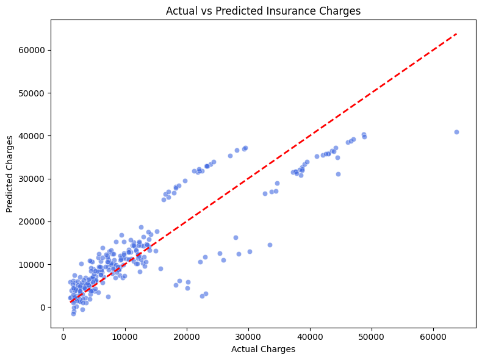
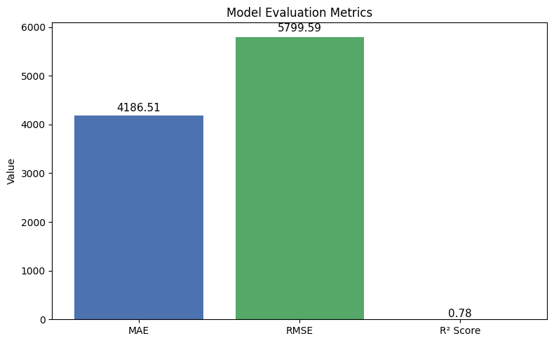

# 💰 Medical Insurance Cost Prediction

**Live Demo:** [https://medical-insurance-cost-prediction-mubeen.streamlit.app/](https://medical-insurance-cost-prediction-mubeen.streamlit.app/)

End-to-end Machine Learning project that predicts medical insurance costs based on personal and lifestyle factors using **Linear Regression**, **Python**, and **Streamlit**.

---

## 📌 Project Overview

This project predicts the medical insurance cost of an individual using features such as age, BMI, gender, number of children, smoking status, and region.

The complete pipeline follows a real-world machine learning workflow:

**Data Collection → Data Cleaning → Exploratory Data Analysis → Model Training → Evaluation → Prediction → Deployment**

---

## 🛠️ Tools & Technologies

- **Python** – Core programming language
- **Pandas & NumPy** – Data manipulation and analysis
- **Scikit-learn** – Machine Learning (Linear Regression)
- **Matplotlib & Seaborn** – Data visualization
- **Streamlit** – Interactive web application
- **Git & GitHub** – Version control and project showcase

---

## ✨ Key Features

- Predict medical insurance cost using Linear Regression
- Clean and well-structured dataset from Kaggle
- Exploratory Data Analysis with multiple visualizations
- Model evaluation using MAE, MSE, RMSE, and R² Score
- Interactive Streamlit web application
- User can input age, BMI, gender, children, smoker status, and region
- Instant prediction of estimated insurance cost

---

## 📈 Key Insights

- Smoking status has a very strong impact on insurance cost
- Insurance charges generally increase with age
- Higher BMI is associated with higher insurance charges
- The Linear Regression model performs well on this dataset
- The model can be used by insurance companies for premium estimation

---

## 📁 Project Structure

```
Medical-Insurance-Cost-Prediction/
│
├── insurance.csv                              # Dataset
├── Medical_Insurance_Cost_Prediction.ipynb    # Complete Jupyter Notebook
├── streamlit_app.py                           # Streamlit Web Application
├── requirements.txt                           # Project dependencies
├── README.md                                  # Project documentation
│
├── src/
│   ├── data_preprocessing.py                  # Data loading & encoding
│   ├── model_training.py                      # Model training & evaluation
│   └── predict.py                             # Prediction function
│
└── images/
    ├── eda/
    ├── model/
    └── app/
```

---

## 🚀 How to Run the Project

### 1. Clone the Repository
```bash
git clone https://github.com/your-username/Medical-Insurance-Cost-Prediction.git
cd Medical-Insurance-Cost-Prediction
```

### 2. Install Dependencies
```bash
pip install -r requirements.txt
```

### 3. Run the Jupyter Notebook
- Open `Medical_Insurance_Cost_Prediction.ipynb` in Google Colab or Jupyter Notebook
- Run all cells sequentially

### 4. Run the Streamlit App
```bash
streamlit run streamlit_app.py
```

---

## 📊 Model Performance

| Metric | Value |
|--------|-------|
| MAE    | (Update after running) |
| MSE    | (Update after running) |
| RMSE   | (Update after running) |
| R² Score | (Update after running) |

---

## 🖼️ Screenshots

### Streamlit Application



### Exploratory Data Analysis





### Model Results


